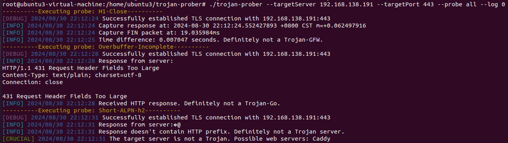
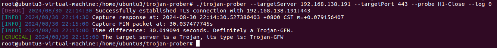

# trojan-prober
Trojan-Prober is a prototype implementation of our TrojanProbe that can be used to actively probe and fingerprint Trojan tunnels by their implementation tricks.  

## Build the tool:    
``CGO_ENABLED=1 GOOS=linux GOARCH=amd64 go build -tags "full" -o trojan-prober ./src``  

## Usage:    
``./trojan-prober --targetServer [target server] --targetPort [target port] --probe [probe name] --log [log level] ``   
```
Options:    
    --targetServer: Target server IP address or domain name. (string type, required)   
    --targetPort:  Target server port. (string type, required)    
    --probe: Prefix of the probe JSON file. Use a specific name to run that probe, or "all" to run all probes automatically. (string type, required)    
    --log:  Log level: 0 for all logs, 1 for crucial logs only, Default is 1. (int type, optional)    
```

## Example:  
For demonstration, please refer to the examples given below:

#### Example1: we use the probe **H1-Close** to detect a caddy server.  


#### Example2:  we use the probe **H1-Close** to detect a trojan-gfw tunnel with caddy as the backend.  


## Cite TrojanProbe:
#### If you use our tool, please cite the paper as follows:  
```
@article{lv2024trojan,  
title={TrojanProbe: Fingerprinting Trojan Tunnel Implementations by Actively Probing Crafted HTTP Requests},  
author={Lv, Liuying and Zhou, Peng},  
journal={Computers & Security (under review)},   
year={2024},  
publisher={Elsevier}  
}
```
